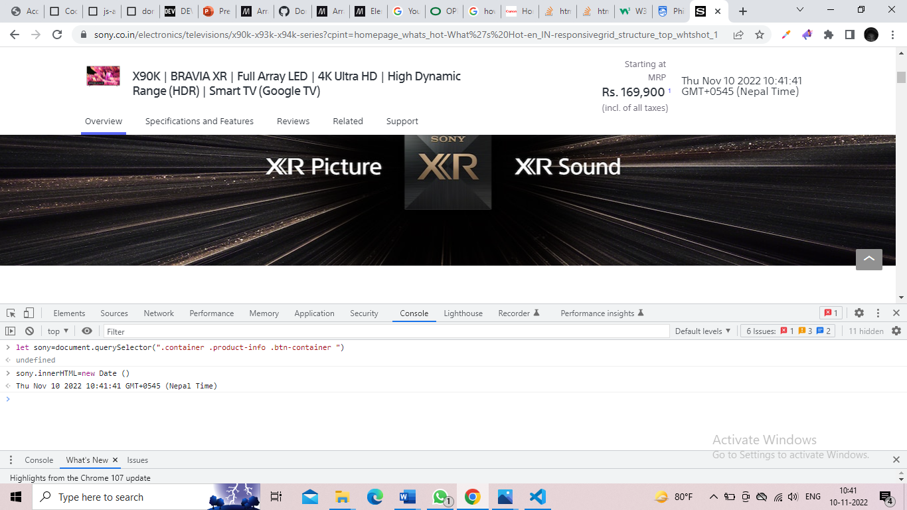
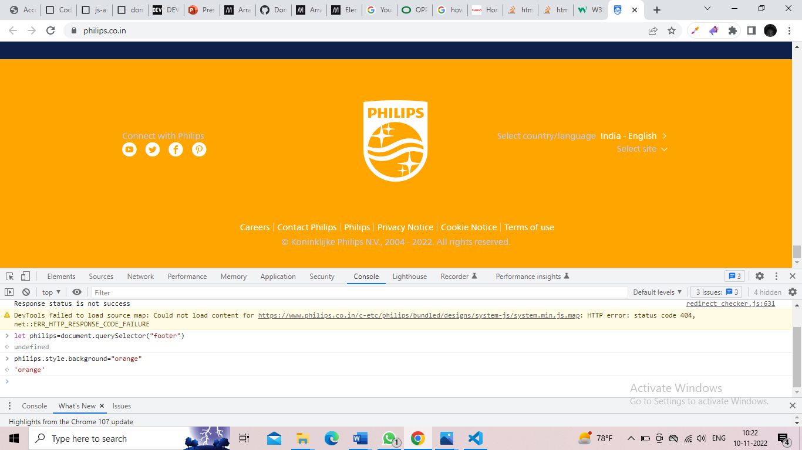

# Dom Manipulation Assignment

### Since some website is not same outside india so i did dom sameway but targeted other place of that site.

1. Webiste Name: [Dev To](https://dev.to/)

### Topics

    - Query Selctory, Inner HTML

### Tasks

        Target the Top description div and change the DEV Community to <Your_Name> and description to your passion

### code
     document.querySelector(".side-bar .crayons-subtitle-2").innerHTML="Roshan Guragain"

     document.querySelector(".side-bar p").innerHTML="I really love playing tennis"

### Output

2. Website Name: [Apple](https://support.apple.com/en-in)

### Task

### Fetch all the product name and store in an array

### code

    let apple=document.querySelectorAll(".as-imagegrid-item-title")​

     apple.forEach((item)=>{​

     const result = item.innerText.replace("Support", "")​
     console.log(result)​

     })

### Output

3. Webiste Name: [Youtube Support](https://support.google.com/youtube/)

### Code

     let youtube=document.querySelector(".article .accordion-homepage")
     let faq=document.createElement("section")
     faq.innerHTML=`<h3>My New Faq</h3>`
     youtube.appendChild(faq)
     faq.setAttribute("class","parent")

### Tasks

     Add another FAQ 'My New FAQ' to the list

### Output

4. Webiste Name: [OnePlus](https://www.oneplus.in/support)

### Topics

     Query Selector, InnerText

### Tasks

      Change the contact number

### Code
     let oneplus=document.querySelector(".oneplus-footer--contact li span")​

     oneplus.innerText="+9779816951739"

### Output

5. Webiste Name: [Samsung](https://www.samsung.com/in/offer/online/samsung-fest/)

### Topics

       getElementById, createElement, InnerText, append, setAttribute

### Tasks

     Target the main div of card and change the Button text to Check out

### Code
     let samgsung=document.querySelectorAll(".diwali-deals-product-sale-pro .diwali-deals-product-sale-btn")[5]​

     samgsung.innerHTML="Check Out"

### Output

6. Webiste Name: [Adidas](https://www.adidas.co.in/)

### Topics

    -   Query Selector, Event listeners, Changing Styles

### Tasks

     Target the search box and on hover change thebackground color to red.

### Code
     let adidas=document.querySelector(".searchinput-wrapper___3YrvF input")​

     adidas.style.backgroundColor="red"

### Output

7. Webiste Name: [MDN Web Docs](https://developer.mozilla.org/en-US/)

### Topics

       Form, Value, Submit

### Tasks

     To Search a topic in the MDN Search bar.
     First add a text to search in the search bar and then hit the submit search button to search the docs using DOM

### Code
     let mdnInput=document.querySelector("#hp-search-input")​

     mdnInput.value="forEach()"​

     let search=document.querySelector("#icon-search-form")​

search.submit()

### Output

8. Webiste Name: [Google](https://www.google.com/)

### Topics

       Remove Elements

### Tasks

     Remove alternate languages from the home page languages listed

### Code
     let google=document.querySelector("#SIvCob a")​
     google.innerHTML="hindi japan and Bhutan"​
     google.remove()

### Output

9. Webiste Name: [Code Wars](https://www.codewars.com/)

### Topics

       Change Font Family, Color of Text.

### Tasks

    Change the font family of the text to monospace and text color to the logo’s background color.

### Code

     let codewar=document.querySelector(".container-medium h1")​codewar.style.fontFamily="monospace"​

     codewar.style.color="#ff4d4d"​
    

     let notchanged=document.querySelector(".container-medium h1 span")​

     notchanged.className="removed"

### Output

10. Webiste Name: [Freecodecamp](https://www.freecodecamp.org/)

### Topics

       querySelector, mouseover, click eventListener,  callback function, style,

### Tasks

    Target the button and change background colour on mouseover

### Code
     let free=document.querySelector(".signup-btn")​

     let mouse=function(){ document.querySelector(".signup-btn .login-btn-text").style.backgroundColor="red"}​

free.addEventListener("mouseover",mouse)

### Output

11. Webiste Name: [realme](https://www.realme.com/in/)

### Topics

       querySelector,style,background-image

### Tasks

    change the realme logo to ineuron logo

### Code
     let realme=document.querySelector(".wrapper a span")​

     realme.style.backgroundImage="url(https://ineuron.ai/images/ineuron-logo.png)"

### Output

12. Webiste Name: [Github](https://github.com/)

### Topics

       querySelector,style,background-Color

### Tasks

     change the background colour of the button to blue.

### Code
     let github=document.querySelector("#new_repository .btn")​

     github.style.background="blue"

### Output

13. Webiste Name: [Hackerrank](https://www.hackerrank.com/)

### Topics

       querySelector,innerHtml

### Tasks

Target the top description and change “Matching developers with great companies” to ‘JSBOOTCAMP“.

### code
     Since can't find the page that was given so I change onther one.​

     let hackerrank=document.querySelector(".fl-rich-text").innerHTML="JS Bootcamp"​

hackerrank

### Output

14. Webiste Name: [Asus](https://www.asus.com/in/)

### Topics

      querySelector,style,font-size

### Tasks

       change the fontsize of “Hot Deals” to 80px

### Code
     let asus=document.querySelector(".HotDealsAll__Heading__2fIbe")​

     asus.style.fontSize="80px"

### Output

15. Webiste Name: [Dell](https://www.dell.com/en-in/shop/deals/laptop-deals?gacd=10415953-9016-5761040-285981356-0&dgc=ST&gclid=Cj0KCQjwguGYBhDRARIsAHgRm4-XUDMhhVNyHXb3s1gY4ZBzORr_d9Se-buhJwy7asyUe7YdqEA11eEaAt6UEALw_wcB&gclsrc=aw.ds&nclid=BxjBlpBQsX6pjSHh-L8YYSU77EpfXRkG1AGMB5Wbeu386ykspfrPDnfx_DdFau20)

### Topics

      querySelector,style.textAlign

### Tasks

       Convert the text “G15 Gaming Laptop” from left to right
### Code
     let dell=document.querySelector("#d560825win9b .ps-top h3")​

     dell.style.textAlign="right"

### Output

16. Webiste Name: [Vercel](https://vercel.com/)

### Topics

     querySelector,innerHTMl

### Tasks

      change the heading “Start with the developer” to “Start with Scratch”

### Code
     document.querySelector("h4").innerHTML="Start with Scratch"

### Output

17. Webiste Name: [Sony](https://www.sony.co.in/)

### Topics

    querySelector,innerHTMl

### Tasks

     change the button text To current Date.

### Code:
     let sony=document.querySelector(".container .product-info .btn-container ")
     sony.innerHTML=new Date ()

### Output

18. Webiste Name: [Philips](https://www.philips.co.in/)

### Topics

     querySelector,style,backgroundcolor

### Sample Image

     

### Tasks

    change the background colour blue to orange

### Output

19. Webiste Name: [Canon](https://in.canon/)

### Topics

          querySelector,src

### code

     let appo= document.querySelector(".wide h3")
     appo.style.color="orange"

### Tasks

    extract the canon logo

### Output

20. Webiste Name: [Oppo](https://www.oppo.com/in/)

### Topics

          querySelector,style,color

### code

      let appo= document.querySelector(".wide h3")
     appo.style.color="orange"

### Output

